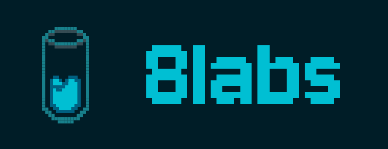
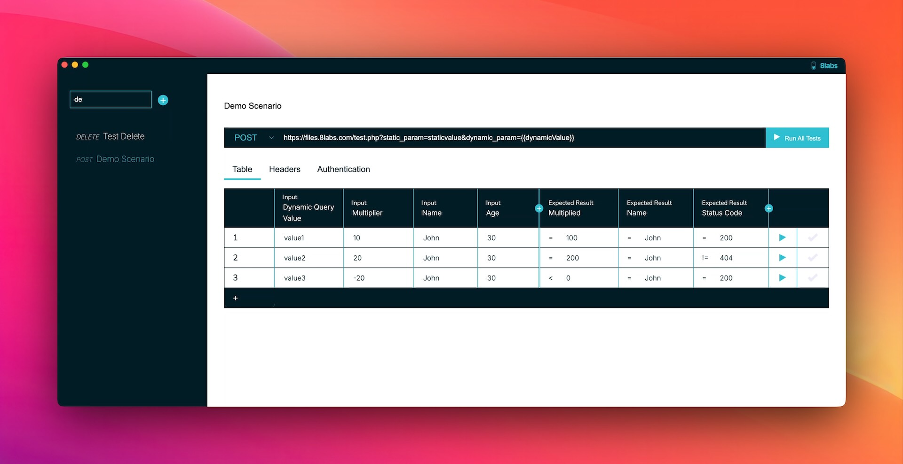

### 8labs Testlab is a dead-simple way to define and run repeatable API tests in a spreadsheet-like UI.

Perfect for devs, testers, and business analysts who care about real-world scenarios, not just unit tests.



## Overview

TestLab is a modern API testing tool that combines the best features of tools like Postman, Bruno, and Insomnia with a unique tabular interface. It's designed to streamline the process of creating and running multiple test cases for API endpoints.

### Key Features

- **Tabular Test Interface**: Create multiple test cases in a single view
- **Efficient Test Creation**: Add multiple permutations of inputs and expected outputs in a structured format
- **Automated Testing**: Run multiple test cases in sequence with detailed reporting
- **It's darn pretty**: Who says open source has to be ugly?

### Who's it for?

- Developers
- QAs
- BAs

### What's it for?

- General API testing
- SIT (System Integration Testing)
- Regression testing
- Boundary and edge case testing
- Data-Driven Testing (DDT)
- Contract testing (at least lightweight testing)
- Testing business rules decisions

## Getting Started

### Prerequisites

- Node.js (v18 or later)

### Installation

1. Clone the repository:
```bash
git clone https://github.com/8labs/testlab.git
cd testlab
```

2. Install dependencies:
```bash
npm install
```

### Development

To run the application in development mode:

```bash
npm run dev
```

### Building

To build the application:

```bash
npm run build
```

The built application will be available in the `dist` directory.

## Usage

1. **Create a New Test Suite**:
   - Click "New Test Suite" to start
   - Enter the base URL for your API endpoint

2. **Add Test Cases**:
   - Use the tabular interface to add multiple test cases
   - Each row represents a unique test case with:
     - Input parameters
     - Headers
     - Expected response values
     - Assertions

3. **Run Tests**:
   - Execute individual test cases or run the entire suite
   - View detailed results and response data

## Variable Mapping and Expressions

TestLab supports powerful variable mapping and expressions for both input and output validation:

### Input Variables

Use handlebars `{{variable}}` syntax to reference variables in:
- Endpoint URLs
- Headers
- Authentication values (username, password, token)

Example:
```
Endpoint: https://api.example.com/users/{{userId}}
Header: Authorization: Bearer {{authToken}}
```

These map directly to the column expression, so for the userId example above, a column defining it would have a column expression of `userId`.

### Request Body Mapping

Use `$.` prefix to map values to JSON request body in the input column expressions:
- `$.user.name` maps to `{ "user": { "name": "value" } }`
- `$.items[0].id` maps to `{ "items": [{ "id": "value" }] }`

### Response Validation

For validating responses, you can use:

1. **JSON Path Expressions**:
   - Use `$.` to reference the root of the response
   - Example: `$.data.user.name` validates the `name` field inside `user` inside `data`

2. **Special Variables**:
   - `{{ http_status }}` - Validates the HTTP status code
   - `{{ count() }}` - Counts array elements in the response
     - Example: `{{ count($.items) }}` validates the number of items in a property called `items` in the root of the json response

3. **Comparison Operators**:
   - `=` (equals)
   - `!=` (not equals)
   - `>` (greater than)
   - `<` (less than)
   - `>=` (greater than or equal)
   - `<=` (less than or equal)
   - `contain` (string contains) (not yet implemented in the ui)
   - `notcontain` (string does not contain) (not yet implemented in the ui)

## Contributing

Contributions are welcome! Please feel free to submit a Pull Request.

## License

This project is licensed under the [MPLv2](https://www.mozilla.org/en-US/MPL/2.0/).

I'm open to dual licensing if someone would like to dicuss a specific situation.

## Acknowledgments

- Built with [Electron](https://www.electronjs.org/)
- Powered by [Vue 3](https://vuejs.org/)
